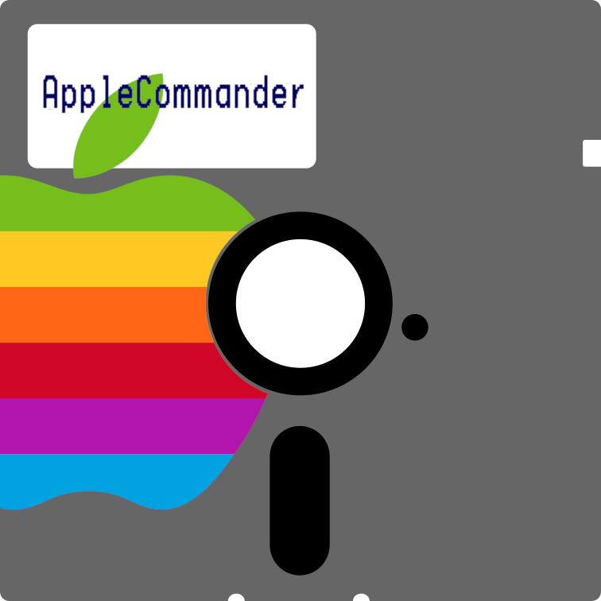

[](https://github.com/umjammer?tab=packages&repo_name=vavi-nio-file-ac)
[](https://jitpack.io/#umjammer/vavi-nio-file-ac)
[](https://github.com/umjammer/vavi-nio-file-ac/actions/workflows/maven.yml)
[](https://github.com/umjammer/vavi-nio-file-ac/actions/workflows/codeql.yml)


# vavi-nio-file-ac



a java nio filesystem spi powered by [AppleCommander](https://github.com/AppleCommander/AppleCommander)

### Status

| ext          | type                      | list | upload | download | copy | move | rm | mkdir | description                                |
|--------------|---------------------------|:----:|:------:|:--------:|:----:|:----:|:--:|:-----:|--------------------------------------------|
| DSK, DO, D16 | DOS 3.x                   |  ✅️  |        |    ✅️    |      |      |    |       | 140K DOS-ordered images                    |
| PO           | DOS 3.x                   |  ✅️  |        |          |      |      |    |       | 140K ProDOS-ordered images                 |
| NIB          | DOS 3.x                   |  ✅️  |        |          |      |      |    |       | 13-sector and 16-sector Nibble images      |
| DC           | DOS 3.x                   |  ✅️  |        |          |      |      |    |       | Disk Copy Images                           |
| D13          | DOS 3.x                   |  ✅️  |        |          |      |      |    |       | 13-sector DOS-ordered images               |
| 2MG, 2IMG    | DOS 3.x                   |  ✅️  |        |          |      |      |    |       | Universal Disk Images                      |
| GZ(DSK)      | DOS 3.x                   |  ✅️  |        |          |      |      |    |       | Compressed images                          |
| WOZ          |                           |  ️   |        |          |      |      |    |       | WOZ Disk Image, version 1 and 2 5.25" only |
| HDV          |                           |  ️   |        |          |      |      |    |       | 32MB ApplePC Hard Disk images              |
|              |                           |  ️   |        |          |      |      |    |       |                                            |
|              | DOS                       |  ️   |        |          |      |      |    |       | both 13-sector and 16-sector               |
|              | UniDOS, OzDOS             |  ️   |        |          |      |      |    |       | 800K formats only                          |
|              | ProDOS                    |  ️   |        |          |      |      |    |       |                                            |
|              | Apple Pascal              |  ️   |        |          |      |      |    |       | 140K and 800K formats                      |
|              | SSI's RDOS                |  ️   |        |          |      |      |    |       | 140K formats only                          |
|              | CP/M                      |  ️   |        |          |      |      |    |       | probably only 140K formats                 |
|              | Gutenberg Word Processor  |  ️   |        |          |      |      |    |       |                                            |
|              | NakedOS                   |  ️   |        |          |      |      |    |       | see the Super-Mon page                     |

## Install

* [maven](https://jitpack.io/#umjammer/vavi-nio-file-ac)

## Usage

### JSR-203 & fuse

```java
    URI uri = URI.create("ac:file:///foo/bar.dsk");
    fs = FileSystems.newFileSystem(uri, Collections.emptyList());
    Fuse fuse = Fuse.getFuse().mount(fs, MOUNT_POINT, Collections.emptyList());
```

## References

 * https://github.com/AppleCommander/AppleCommander/issues/207

## TODO

 * raw disk access

---

<sub>disk image by <a href="https://freesvg.org/floppy-disk-icon">freesvg.org</a> and Apple logo © Apple Inc.</sub>
